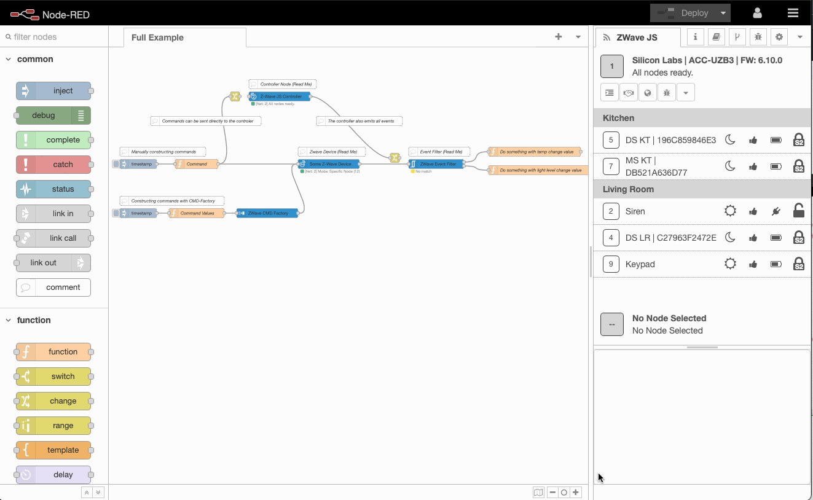
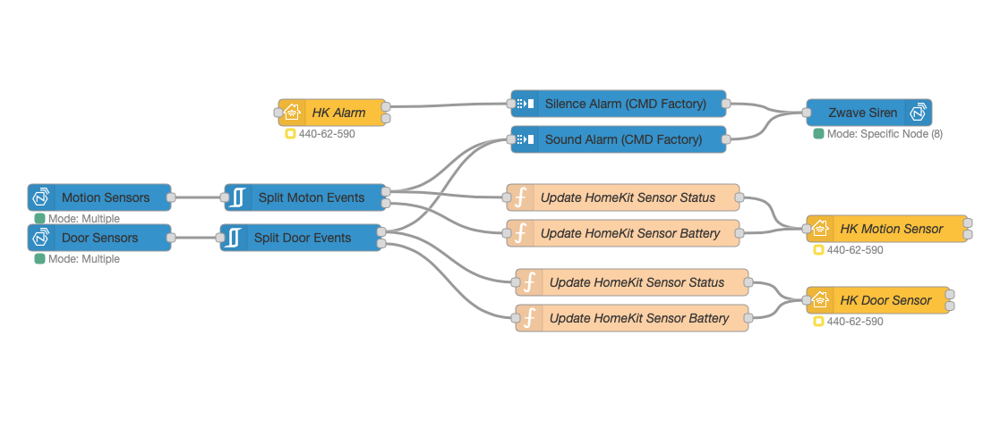

# node-red-contrib-zwave-js

The most powerful, high performing and highly polished Z-Wave node for Node-RED based on Z-Wave JS. If you want a fully featured Z-Wave framework in your Node-RED instance, you have found it.

> ### ...node-red-contrib-zwave-js is _hands down the best Z-Wave to Node-RED option on the planet._
> [@CRXPorter](https://github.com/crxporter), July 2021.

## What is it?

 - Part of the awesome [Z-Wave JS](https://github.com/zwave-js) org
 - 100% Javascript, so its blazing fast!
 - Does not require a build of any static library
 - Stable
 - A deep integrated UI within in node red
 - Full Z-Wave control inside Node-RED including:
   - Multi Stick/Network support
   - Device inclusion/exclusion wizard
   - S0 and S2 security support
   - Supports Security S2 Smart Start via a Mobile (and local) companion web application.
   - Network health checks
   - Network mesh graph
   - Device Firmware updates
   - Advanced RF configuration
   - NVM Backup/Restore
   - Associations management
   - Filter node for handling incoming messages from your devices
   - Factory node for simplifying the formatting of outgoing messages
   - Multicast command support
   - And much more..

Since `node-red-contrib-zwave-js` is based on [Z-Wave JS](https://zwave-js.github.io/node-zwave-js/#/), we have the support and active maintenance from the amazing group of developers who have built the libraries, APIs, and config files which run this contrib.

## The User Interface

Included with the contrib is a [user interface](https://github.com/zwave-js/node-red-contrib-zwave-js/wiki/User-Interface) where Z-Wave network management is handled. The controller side of the UI is used to include/exclude devices, heal the network, update firmware, and view the network map for diagnosing problems. The device side of the UI is used to configure devices, manage associations, and provide setup help for the nodes which will be used in your flows.

## The Nodes

There are 4 node types included with this contrib ([click here](https://github.com/zwave-js/node-red-contrib-zwave-js/wiki/node-types) for full details about these nodes)
 - `ZWave Controller`: this node is used to set up a connection to your USB Z-Wave controller, set security keys, and manage various advanced controller options
 - `ZWave Device`: this node is used to send and receive messages to one or more of the Z-Wave devices on your network
 - `Event Filter`: this node is used to filter and sort messages from your Z-Wave devices
 - `CMD Factory`: this node simplifies creation of messages being sent to your Z-Wave devices

## Getting Started Links
 - [Installing](https://github.com/zwave-js/node-red-contrib-zwave-js/wiki/getting-started): system requirements and install instructions
 - [Just Show Me How](https://github.com/zwave-js/node-red-contrib-zwave-js/wiki/First-Z-Wave-Flow-Setup): first day walkthrough
 - [Wiki](https://github.com/zwave-js/node-red-contrib-zwave-js/wiki/getting-started): just about everything
 - [Change Log](./CHANGELOG.md): whats changed?

## Environment Variables

The following environment variables can be used to customize the behavior of node-red-contrib-zwave-js:

- `ZWAVE_JS_PROTOCOL`: Override the protocol (http/https) used in URLs generated by the web interface. This is particularly useful when running nodeRED in a docker container that is behind a reverse proxy that handles HTTPS termination. By default, HTTPS is used when secure mode is enabled and HTTP when it's disabled. Examples:
  - If your reverse proxy (like Caddy) handles HTTPS and forwards to Node-RED over HTTP, set this to `https` to ensure the browser generates secure URLs while still allowing Node-RED to run with HTTP internally.
  - Default behavior without this variable: Uses `https://` when requests are https, and `http://` when requests are http.

## Awesome People - Thanks!

 - [marcus-j-davies](https://github.com/marcus-j-davies) our main developer who claims "*my software doesn't have bugs*"
 - [AlCalzone](https://github.com/AlCalzone) for creating [ZWave-JS](https://github.com/zwave-js/node-zwave-js) that makes this possible
 - [hufftheweevil](https://github.com/hufftheweevil) for creating the User Interface tab
 - [CRXPorter](https://github.com/crxporter) for creating all the help material/finding this project
 - [thk](https://github.com/thk-socal) for the relentless beta testing

 ## License
 MIT License

Copyright (c) 2019 Marcus Davies

Permission is hereby granted, free of charge, to any person obtaining a copy
of this software and associated documentation files (the "Software"), to deal
in the Software without restriction, including without limitation the rights
to use, copy, modify, merge, publish, distribute, sublicense, and/or sell
copies of the Software, and to permit persons to whom the Software is
furnished to do so, subject to the following conditions:

The above copyright notice and this permission notice shall be included in all
copies or substantial portions of the Software.

THE SOFTWARE IS PROVIDED "AS IS", WITHOUT WARRANTY OF ANY KIND, EXPRESS OR
IMPLIED, INCLUDING BUT NOT LIMITED TO THE WARRANTIES OF MERCHANTABILITY,
FITNESS FOR A PARTICULAR PURPOSE AND NONINFRINGEMENT. IN NO EVENT SHALL THE
AUTHORS OR COPYRIGHT HOLDERS BE LIABLE FOR ANY CLAIM, DAMAGES OR OTHER
LIABILITY, WHETHER IN AN ACTION OF CONTRACT, TORT OR OTHERWISE, ARISING FROM,
OUT OF OR IN CONNECTION WITH THE SOFTWARE OR THE USE OR OTHER DEALINGS IN THE
SOFTWARE.
