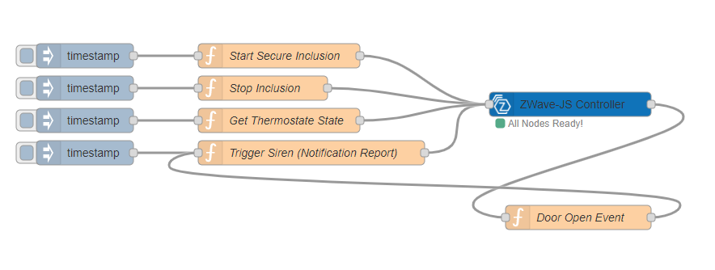

  

# node-red-contrib-zwave-js
An extremely easy to use, zero dependency and feature rich ZWave node for node-red. Based on ZWave-JS

The implementation is 100% javascript. it is therefore:  
  - Very fast
  - Does not require a build of any static library
  - Stable

Install this node via the Node-Red pallet menu, and you have zwave abilities.  
The node is straightforward to use, and removes all the complexities that you would otherwise need to deal with.

  - Add the node into your flow
  - Select the serial port that represents your USB Zwave radio.
  - Set an encryption key (string or hex array [0x01,0x02]) if you want to use Secure devices.
  - Listen for, and send commands using the node.

    

**node-red-contrib-zwave-js** is based on  [ZWave-JS](https://zwave-js.github.io/node-zwave-js/#/).  
ZWave-JS is actively  maintained, fast and supports the security command class.

## Usage Modes
node-red-contrib-zwave-js, is split into 3 different usage modes.

[Managed](managed.md)  
If you're wanting to get up and running quickly, or not familar with Z-Wave JS, then this is for you.

[Unmanaged](unmanaged.md)   
If you're familar with Z-Wave JS, or a more hardened user, to various z-wave stack implementations, then this may be more usefull.  

GUI  
This mode comes as a node-red UI. It's more for managing your network, but can alter certain values.
just open up the UI tab (on the right)

Whatever your poison, the node will inject the following events, into your flow.

| event                       | node                                | object                          | Meaning                           |
| --------------------------- | ----------------------------------- | ------------------------------- | --------------------------------- |  
| NODE_ADDED                  | The ID of the added node            |                                 | A Node Was Added                  |
| NODE_REMOVED                | The ID of the removed node          |                                 | A Node Was Removed                |
| NODE_NAME_SET               | The ID of the affected node         |                                 | Node name was set                 |
| NODE_LOCATION_SET           | The ID of the affected node         |                                 | Node location was set             |
| INCLUSION_STARTED           |                                     | Bool : Secure Include           | Include Mode Started              |
| INCLUSION_STOPPED           |                                     |                                 | include Mode Stopped              |
| EXCLUSION_STARTED           |                                     |                                 | Exclude Mode Started              |
| EXCLUSION_STOPPED           |                                     |                                 | Exclude Mode Stopped              |
| NETWORK_HEAL_DONE           |                                     |                                 | Done Healing Network              |
| NETWORK_HEAL_STARTED        |                                     |                                 | Started Healing Network           |
| NETWORK_HEAL_STOPPED        |                                     |                                 | Stopped Healing Network           |
| CONTROLLER_RESET_COMPLETE   |                                     |                                 | The controller was reset          |
| VALUE_UPDATED               | The source Node ID                  | The objects command content     | A Value Was Updated               |
| VALUE_NOTIFICATION          | The source Node ID                  | The objects command content     | A Value Notification Was Received |
| NOTIFICATION                | The source Node ID                  | Command Class ID & Event Data   | A Notification Was Sent           |
| WAKE_UP                     | The source Node ID                  |                                 | A Node Has Woken Up               |
| SLEEP                       | The source Node ID                  |                                 | A Node Has Gone To Sleep          |
| INTERVIEW_COMPLETE          | The source Node ID                  |                                 | The node has been interviewed     |
| INTERVIEW_FAILED            | The source Node ID                  | Detailed Error Info             | Could not interview node          |
| INTERVIEW_STARTED           | The source Node ID                  |                                 | Node interview started            |
| NODE_LIST                   |                                     | ZWaveNode[]                     | Response to GetNodes              | 
| VALUE_ID_LIST               | The source Node ID                  | ValueID[]                       | Response to GetDefinedValueIDs    | 
| GET_VALUE_RESPONSE          | The source Node ID                  | Value & Value ID                | Response to GetValue              | 
| GET_VALUE_METADATA_RESPONSE | The source Node ID                  | Metadata & Value ID             | Response to GetValueMetadata      | 

And such event(s) will look like this.

```
{
  payload: {
    node: 2,
    event: "VALUE_UPDATED",
    timestamp: "23-12-2020T12:23:23+000",
    object: ...
  }
}
```

## Controller based operations
Accessing the UI, will provide you with most of the network management operations.  
But, if you prefer, you can action them via a node message.  
  
The **Controller** class does not require a **node** ID.  

| class                     | operation                           | params                                                |
| ------------------------- | ----------------------------------- | ----------------------------------------------------- |
| Controller                | StartHealNetwork                    |                                                       |
| Controller                | StopHealNetwork                     |                                                       |
| Controller                | StartInclusion (see Notes)          | [Bool : Include Non-Secure (optional)]                |
| Controller                | StopInclusion                       |                                                       |
| Controller                | StartExclusion                      |                                                       |
| Controller                | StopExclusion                       |                                                       |
| Controller                | HardReset (see Notes)               |                                                       |
| Controller                | ProprietaryFunc (See Notes)         | [Number : Serial Function ID, Buffer : Data]          |
| Controller                | InterviewNode                       | [Number : Node ID]                                    |
| Controller                | GetNodes                            |                                                       |
| Controller                | SetNodeName                         | [Number : Node ID, String : Node Name]                |
| Controller                | SetNodeLocation                     | [Number : Node ID, String : Node Location]            |

To start Inclusion, you will do.  
```
{
  payload: {
    class: "Controller",
    operation: "StartInclusion",
    params: [true]
  }
}
```

## Notes on StartInclusion  
By default, the include process will only include secure devices, if you want to include non-secure devices, provide a **true** value 

## Notes on HardReset  
A one-way ticket for wiping out all the configuration on the controller.  
Once you call this method, there is no going back - you are hearby **WARNED of the consequences**.  

## Notes on ProprietaryFunc
The **Data** argument, must ONLY contain the data portion of the request  
As an example, this byte array **[0x01, 0x08, 0x00, 0xF2, 0x51, 0x01, 0x00, 0x05, 0x01, 0x51]**  
disables the LED on the GEN 5 Z-Stick, breaking it down we have:  

0x01 - SOF  
0x08 - Total Length  
0x00 - REQ  
0xF2 - Aeotec Set Configuration Function  
0x51 - LED Configuration  
0x01 - Configuration Value Size  
0x00 - Value  
0x05 - ??  
0x01 - ??  
0x51 - Serial API Checksum  

This means we do:

```
/* LED Configuration
 * Configuration Value Size
 * Value
 * ??
 * ??
 */

let _Buf_OFF = Buffer.from([0x51,0x01,0x00,0x05,0x01])
let _Buf_ON = Buffer.from([0x51,0x01,0x01,0x05,0x01])
                                                      
{
  payload:{
    node: 2,
    class: "Controller",
    operation:"ProprietaryFunc",
    params: [0xF2, _Buf_OFF]
  }
}
```

**SOF**, **Total Length**, **REQ** & the **Serial API Checksum** will be provided for you.


## Version History  

  - 3.0.0 **Possible Breaking Changes**
    - Bug Fixes to Management UI
    - Controller Node, is now identified in the UI
    - Migrated to Z-Wave JS V7
    - Logging options added to config UI
    - Some 1.4.0 optimsiations removed, as recent changes to Z-Wave JS has made them unnecessary
    - Changes to the **NOTIFICATION** event.
        The **object** component will now contain the following structure
        ```
        {
          ccId: Number - The Command Class ID,
          args: The main event data (simple or complex, hihgly dependant on the CC)
        }  
        ```  
    - Controller operation **GetNodes** no longer returns an empty entry.
    - Fixed newly added nodes, not being marked as ready (and therefore not passing events)  
    - Per node information when calling **GetNodes** has been substantially increased.
    - Node status is now a string ("Unknown","Asleep","Awake","Dead","Alive")
    - Added a Controller function **SetNodeLocation**  


  - 2.0.0
    - Added a User Interface tab, allowing control/maintenance of the zwave network. ([#22](https://github.com/zwave-js/node-red-contrib-zwave-js/issues/22))
    - Added an Unmanaged operation **GetValueMetadata**
    - Added a Controller function **SetNodeName**
    - Bump Z-Wave JS,
    - Bump serialports
    - Driver timeouts now use defaults if not provided.
    - Version information is now displayed in config UI.
    - Added support for **Indicator** CC to Managed mode.
    - Added support for **Meter** CC to Managed mode.  
    - Optimisations to param conversations, when params are in the form of a class on the Z-Wave JS side  
    - Secure include is now by default.

  - 1.4.0  **Possible Breaking Change**  
    - Bump Z-Wave JS to 6.4.0
    - The response to the Unmanaged method **GetValue** is now delivered via a **GET_VALUE_RESPONSE** event, where the **object** property contains the return value, and the Value ID
    - Fix Node Red crash on failure listing serial ports ([#18](https://github.com/zwave-js/node-red-contrib-zwave-js/pull/18))  
    - Optimisations to speed up initialisation of already inetrviewed nodes ([#20](https://github.com/zwave-js/node-red-contrib-zwave-js/issues/20))  
    - Added **Thermostat Operating State** CC to Managed mode.  
    - Added **Thermostat Setback** CC to Managed mode.  
    - Added **Color Switch**  CC to Managed mode.  

  - 1.3.1
    - Z-Wave JS **value notification** event, is now delivered exclusively due to a difference in its payload from normal value updates. ([#12](https://github.com/zwave-js/node-red-contrib-zwave-js/issues/12))

  - 1.3.0
    - Custom serial ports can now be provided. ([#7](https://github.com/zwave-js/node-red-contrib-zwave-js/pull/7))  
    - Bumped Z-Wave JS to 6.1.0  
    - Bumped Serial Ports to 9.0.6 
    - Fixed incorrect method signature for **RemoveNodes**  
    - Renamed **endPoint** to be more consistent with Z-Wave JS ([#10](https://github.com/zwave-js/node-red-contrib-zwave-js/pull/10))  
    - Defaulted **Params** to an empty array if not provided ([#10](https://github.com/zwave-js/node-red-contrib-zwave-js/pull/10))

  - 1.2.0
    - Added Binary Sensor CC support  
    - Added Lock CC support
    - Added Support for **getDefinedValueIDs**, **setValue** and **getValue** methods
    - Restructured core code.  
    - Encryption key can now be a hex array ([#5](https://github.com/zwave-js/node-red-contrib-zwave-js/issues/5)).

  - 1.1.1
    - Tidy up read me  
    - Optimisations to red event management
    - Broader range of events to capture value updates implemented.

  - 1.1.0 **Possible Breaking Change**  
    - Added **Door Lock**  CC to Managed mode.  
    - Added **Association**  CC to Managed mode.  
    - Added **Group Info**  CC to Managed mode.  
    - Fixed potential exception with operations that require a string value,
      They are now converted to their respective ZWave-JS numericle counterparts
    - Fixed Required, Optional parameter checking routine.
    - Duration object structure has been updated to correct a potential exception  
      Initially, the Duration object did not call the ZWave-JS Duration constructor - this has now been fixed.
    - Improvements to notification objects. **eventParameters** and **sequenceNumber** can now be provided


  - 1.0.5
    - Fixed mis-configured timeout defaults  
      If you're affected by this bug, remove, then re-add the node after the update.

  - 1.0.4
    - Ability to re-interview the nodes about their offerings.  
    - Added INTERVIEW_STARTED, INTERVIEW_COMPLETE and INTERVIEW_FAILED events.  
    - Added exception handling for invalid node ID's.  
    - Added a GetNodes function to the Controller class.  
    - Minor bug fixes.  

  - 1.0.3
    - Controller HardReset method added.  
    - Code formatting improved.
    - Read Me improvments  

  - 1.0.2
    - Potential erros during initialising are now handled.  
    - Added the ability to supply an **endPoint** parameter within the payload to target a specific channel (i.e multiple sockets for an outlet)  
    - Optimisations to driver configurarion.

  - 1.0.1
    - Fixed typo in package.json.

  - 1.0.0
    - Initial Release


