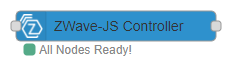

  

# node-red-contrib-zwave-js

THE ultimate Z-Wave node for node-red based on Z-Wave JS.  
If you want a fully featured Z-Wave runtime in your node-red instance, look no further.


  - 100% Javascript, so it's blazing fast and runs in the same memory space as your flows.
  - Does not require a build of any static library
  - Stable
  - A Built in Node-Red User Interface tab:
    - Device Configuration
    - CC Value Updating
    - Association Management
    - Firmware Updating
    - Network Map
    - Network Actions (Include, Exclude, Heal etc etc)
  - 2 Different API models, catering for both experienced and inexperienced users.
  - Use one node for your entire network, or a node per Z-Wave device.
  - Access to all supported CC's provided by Z-Wave JS.

**node-red-contrib-zwave-js** is based on  [&#x1F517;Z-Wave JS](https://zwave-js.github.io/node-zwave-js/#/).  
Z-Wave JS is actively  maintained, fast and supports secure (S0) devices - S2 is in the works.

It offers a massive amount of flexibility and is packed full of features.   
The node is straightforward to use, and removes all the complexities that you would otherwise need to deal with.

Install this node via the Node Red palette menu (See [Home Assistant Install](#home-assistant-install) if this applies to you),  
and you have Z-Wave support in Node Red. 

## The gist
  - Add the node(s) into your flow
  - Select the serial port that represents your USB Zwave radio.
  - Set an encryption key if you want to use Secure devices.
    - Plain text (16 characters)
    - Or hex array (16 bytes) [0x01,0x02]
  - Listen for, and send commands using the node.

    

## Home Assistant Install
Please note: This is a self contained Z-Wave driver for Node Red, it will not work along side the Z-Wave add-on for Home Assistant.  
If however, you use the Node Red add-on, and want Z-Wave to be managed from with-in Node Red, see below for instructions.  

  - Do not attempt to install this node, via the palette menu - it will likely not install some serial port stuff.  
  - Edit the Node Red add-on configuration as below (specifically  **system_packages** and **npm_packages**)
  - Restart the add-on/Node Red - and you should be ready to go.  

```yaml
system_packages:
  - make
  - python3
  - g++
  - gcc
  - linux-headers
  - udev
npm_packages:
  - serialport
  - node-red-contrib-zwave-js
```

## Node config (Advanced Driver Settings)
**Custom CFG Dir**  
Z-Wave JS allows a custom directory, that will be used to search for additonal Device configuration files.  
Note: if an internal device config is found to have the same identifiers, the one in the directory folder will take priority.  
Please also note, the specified directory will be recursively scanned.   

**Disk IO Throttle**  
If using the **ValueAPI** Mode (see further down), the values received from **getValue**, will be from a cache.  
This cache is periodically written to disk. This setting allows you to control that behavioir.  
Unless there is a specific reason to do so - its best to leave it as 'Normal'

| Setting       | Description                                    | 
| ------------- | -----------------------------------------------|
| Normal        | A compromise between the two options below     |           
| Slow          | At most, every 5 minutes or after 500 changes  |   
| Fast          | Immediately writes every change to disk        |   

## Node Types
There are 2 node types.  

**Z-Wave JS Controller**:  
Allows a single point of entry to/from your zwave network - This is the main Node.  
You can address any zwave device, and recieve updates from them, using this node.  
  

**ZWave Device**:  
Works in conjunction with the Controller Node above, but represents a single zwave device.  
Multiple copies of this node, can be used across different flows.  
  

## Usage Modes
**node-red-contrib-zwave-js**, is split into 3 different usage modes.  
The first 2 of these modes, is probably what you're intersted in.  
Each have there own pros and cons.  

[&#x1F517;CC API](./CCAPI.md) (Z-Wave JS Command Classes API)  
This mode is quick to get up and running, and is a good starting point.

[&#x1F517;Value API](./ValueAPI.md) (Z-Wave JS Value API)  
This mode requires a little more understanding, but is preferred by the pros.

[&#x1F517;GUI](./GUI.md)   
This mode comes as a node-red UI. It's more for managing your network, but can alter certain values.

Whatever your poison, the node will inject the following events, into your flow.

| event                       | node                                | object                          | Meaning                           |
| --------------------------- | ----------------------------------- | ------------------------------- | --------------------------------- |  
| NODE_ADDED                  | The ID of the added node            |                                 | A Node Was Added                  |
| NODE_REMOVED                | The ID of the removed node          |                                 | A Node Was Removed                |
| NODE_NAME_SET               | The ID of the affected node         |                                 | Node name was set                 |
| NODE_LOCATION_SET           | The ID of the affected node         |                                 | Node location was set             |
| INCLUSION_STARTED           | "Controller"                        | Bool : Secure Include           | Include Mode Started              |
| INCLUSION_STOPPED           | "Controller"                        |                                 | Include Mode Stopped              |
| INCLUSION_FAILED            | "Controller"                        |                                 | Include Failed                    |
| EXCLUSION_STARTED           | "Controller"                        |                                 | Exclude Mode Started              |
| EXCLUSION_STOPPED           | "Controller"                        |                                 | Exclude Mode Stopped              |
| EXCLUSION_FAILED            | "Controller"                        |                                 | Exclude Failed                    |
| NETWORK_HEAL_DONE           | "Controller"                        | The Heal outcome                | Done Healing Network              |
| NETWORK_HEAL_STARTED        | "Controller"                        |                                 | Started Healing Network           |
| NETWORK_HEAL_STOPPED        | "Controller"                        |                                 | Stopped Healing Network           |
| CONTROLLER_RESET_COMPLETE   | "Controller"                        |                                 | The controller was reset          |
| VALUE_UPDATED               | The source Node ID                  | The objects command content     | A Value Was Updated               |
| VALUE_NOTIFICATION          | The source Node ID                  | The objects command content     | A Value Notification Was Received |
| NOTIFICATION                | The source Node ID                  | Command Class ID & Event Data   | A Notification Was Sent           |
| WAKE_UP                     | The source Node ID                  |                                 | A Node Has Woken Up               |
| SLEEP                       | The source Node ID                  |                                 | A Node Has Gone To Sleep          |
| INTERVIEW_COMPLETE          | The source Node ID                  |                                 | The node has been interviewed     |
| INTERVIEW_FAILED            | The source Node ID                  | Detailed Error Info             | Could not interview node          |
| INTERVIEW_STARTED           | The source Node ID                  |                                 | Node interview started            |
| NODE_LIST                   | "Controller"                        | ZWaveNode[]                     | Response to GetNodes              | 
| VALUE_ID_LIST               | The source Node ID                  | ValueID[]                       | Response to GetDefinedValueIDs    | 
| GET_VALUE_RESPONSE          | The source Node ID                  | Value & Value ID                | Response to GetValue              | 
| GET_VALUE_METADATA_RESPONSE | The source Node ID                  | Metadata & Value ID             | Response to GetValueMetadata      | 
| ENUM_LIST                   | "N/A"                               | All valid Enum Values           | Response to GetEnums              | 
| ASSOCIATION_GROUPS          | The source Node ID                  | Association Group Info[]        | Response to GetAssociations       |  
| ALL_ASSOCIATION_GROUPS      | The source Node ID                  | Association Group Info[]        | Response to GetAllAssociations    |  
| ASSOCIATIONS                | The source Node ID                  | Configured Associations         | Response to GetAssociations       |  
| ALL_ASSOCIATIONS            | The source Node ID                  | Configured Associations         | Response to GetAllAssociations    |  
| ASSOCIATIONS_ADDED          | The source Node ID                  |                                 | Associations Were Added           |  
| ASSOCIATIONS_REMOVED        | The source Node ID                  |                                 | Associations Were Removed         |  
| ALL_ASSOCIATIONS_REMOVED    | The source Node ID                  |                                 | All Associations Were Removed     |  
| VALUE_DB                    | "N/A"                               | A Structured Value DB object    | Response to GetValueDB            |  
| NODE_NEIGHBORS              | The source Node ID                  | Array of Node IDs               | Response to GetNodeNeighbors      |  
| NODE_KEEP_AWAKE             | The source Node ID                  | Bool : Keep Awake Status        | Response to KeepNodeAwake         |  
| CURRENT_RF_REGION           | "Controller"                        | The current RF Region           | Response to GetRFRegion           |  
| RF_REGION_SET               | "Controller"                        | The RF Region that was set      | Response to SetRFRegion           |  
| RF_STATUS                   | "Controller"                        | The RF Status                   | Response to ToggleRF              |  
| FIRMWARE_UPDATE_COMPLETE    | The source Node ID                  | Result Status                   | Firmware Update finished          |  
| FIRMWARE_UPDATE_STARTED     | The source Node ID                  | Target Chip                     | Firmware Update Started           |  
| FIRMWARE_UPDATE_ABORTED     | The source Node ID                  |                                 | Firmware Update Aborted           |  


And such event(s) will look like this.

```javascript
{
  payload: {
    node: 2,
    event: "VALUE_UPDATED",
    timestamp: "23-12-2020T12:23:23+000",
    object: {}
  }
}
```

## Controller/Driver and Association based methods
Accessing the UI, will provide you with most of the network management operations.  
But, if you prefer, you can action them via a node message.  
  
The **ControllerAPI**, **DriverAPI** and **AssociationsAPI** modes do not require a **node** ID.  
However! Some Controller and Association methods themself, actually need a Node ID as part of the required params.  

Some Association methods require an Object, these are detailed at the bottom.

| mode                         | method                              | params                                                |
| ---------------------------- | ----------------------------------- | ----------------------------------------------------- |
| ControllerAPI                | beginHealingNetwork                 |                                                       |
| ControllerAPI                | stopHealingNetwork                  |                                                       |
| ControllerAPI                | beginInclusion (See Notes)          | [Include Non-Secure: Bool (optional)]                 |
| ControllerAPI                | stopInclusion                       |                                                       |
| ControllerAPI                | beginExclusion                      |                                                       |
| ControllerAPI                | stopExclusion                       |                                                       |
| ControllerAPI                | hardReset (See Notes)               |                                                       |
| ControllerAPI                | proprietaryFunction (See Notes)     | [Serial Function ID: Number, Data: Buffer]            |
| ControllerAPI                | refreshInfo                         | [Node ID: Number]                                     |
| ControllerAPI                | getNodes                            |                                                       |
| ControllerAPI                | setNodeName                         | [Node ID: Number, Node Name: String]                  |
| ControllerAPI                | setNodeLocation                     | [Node ID: Number, Node Location: String]              |
| ControllerAPI                | getNodeNeighbors                    | [Node ID: Number]                                     |
| ControllerAPI                | keepNodeAwake                       | [Node ID: Number, Bool]                               |
| ControllerAPI                | getRFRegion (See Notes)             |                                                       |
| ControllerAPI                | setRFRegion (See Notes)             | [**RFRegion**: Enum]                                  |
| ControllerAPI                | toggleRF                            | [Status: Bool]                                        |
| ControllerAPI                | removeFailedNode                    | [Node ID: Number]                                     |
| ControllerAPI                | replaceFailedNode (See Notes)       | [Node ID: Number, Include Non-Secure: Bool (optional)]|
| ControllerAPI                | beginFirmwareUpdate                 | [Node ID: Number, Target Chip: Number, Filename: String, Data: Buffer]|
| ControllerAPI                | abortFirmwareUpdate                 | [Node ID: Number]                                     |
| AssociationsAPI              | getAssociationGroups                | [**AssociationAddress**: Object]                      |
| AssociationsAPI              | getAllAssociationGroups             | [Node ID: Number]                                     |
| AssociationsAPI              | getAssociations                     | [**AssociationAddress**: Object]                      |
| AssociationsAPI              | getAllAssociations                  | [Node ID: Number]                                     |
| AssociationsAPI              | addAssociations                     | [**AssociationAddress**: Object, Group  ID: Number, **AssociationAddress**: Object[]] |
| AssociationsAPI              | removeAssociations                  | [**AssociationAddress**: Object, Group  ID: Number, **AssociationAddress**: Object[]] |
| AssociationsAPI              | removeNodeFromAllAssociations       | [Node ID: Number]                                     |
| DriverAPI                    | getEnums                            |                                                       |
| DriverAPI                    | getValueDB                          | [Node ID: Number[] (Optional)]                        |

To start an in-secure Inclusion, you will do.  
```javascript
let Message = {
    payload: {
        mode: "ControllerAPI",
        method: "startInclusion",
        params: [true]
    }
}
return Message;
```

## Notes on ControllerAPI -> Set/Get RF Region  
Support for these Commands, must be proivided by your stick.  

## Notes on ControllerAPI -> beginInclusion/replaceFailedNode  
By default, the include process will only include secure devices, if you want to include non-secure devices, provide a **true** value 

## Notes on ControllerAPI -> hardReset  
A one-way ticket for wiping out all the configuration on the controller.  
Once you call this method, there is no going back - you are hearby **WARNED of the consequences**.  

## Notes on ControllerAPI -> proprietaryFunction
The **Data** argument, must ONLY contain the data portion of the request  
As an example, this byte array **[0x01, 0x08, 0x00, 0xF2, 0x51, 0x01, 0x00, 0x05, 0x01, 0x51]**  
disables the LED on the GEN 5 Z-Stick, breaking it down we have:  

0x01 - SOF  
0x08 - Total Length  
0x00 - REQ  
0xF2 - Aeotec Set Configuration Function  
0x51 - LED Configuration  
0x01 - Configuration Value Size  
0x00 - Value  
0x05 - ??  
0x01 - ??  
0x51 - Serial API Checksum  

This means we do:

```javascript
/* LED Configuration
 * Configuration Value Size
 * Value
 * ??
 * ??
 */

let _Buf_OFF = Buffer.from([0x51, 0x01, 0x00, 0x05, 0x01])
let _Buf_ON = Buffer.from([0x51, 0x01, 0x01, 0x05, 0x01])

let Message = {
    payload: {
        node: 2,
        mode: "ControllerAPI",
        method: "proprietaryFunction",
        params: [0xF2, _Buf_OFF]
    }
}
return Message
```

**SOF**, **Total Length**, **REQ** & the **Serial API Checksum** will be provided for you.

## Object Structures
**AssociationAddress**
```javascript
{
    nodeId: Number,
    endpoint: Number (optional - defaults to 0)
}
```

## Version History  

 - Now [Here](./CHANGELOG.md)