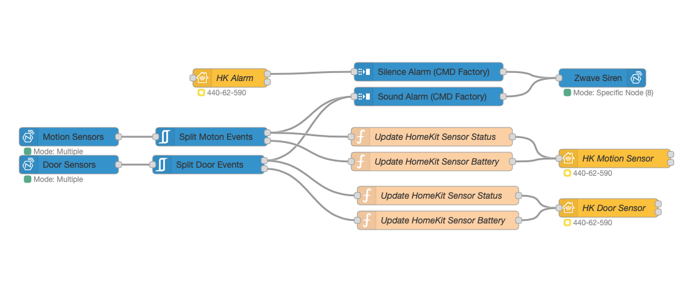

  

# node-red-contrib-zwave-js
   

THE most powerful Z-Wave node for node-red based on Z-Wave JS.  
If you want a fully featured Z-Wave runtime in your node-red instance, look no further.  
   
> ### ...node-red-contrib-zwave-js is _hands down the best zwave to node red option on the planet._  
> [@CRXPorter](https://github.com/crxporter), July 2021.  
   

  - 100% Javascript, so it's blazing fast and runs in the same memory space as your flows.
  - Does not require a build of any static library
  - Stable
  - Supports ZWave S0 and S2 Security
  - A Built in Node-Red User Interface tab:
    - Device Configuration
    - CC Value Updating
    - Association Management
    - Firmware Updating
    - Network Map
    - Network Actions (Include, Exclude, Heal etc etc)
  - 2 Different API models, catering for both experienced and inexperienced users.
  - Use one node for your entire network, or a node per Z-Wave device.
  - An extremely advanced filter node, to route zwave messages around your flow(s).
  - Supports multicast to send commands to mulltiple nodes at the same time.
  - Access to all supported CC's provided by Z-Wave JS.

**node-red-contrib-zwave-js** is based on  [&#x1F517;Z-Wave JS](https://zwave-js.github.io/node-zwave-js/#/).  
Z-Wave JS is actively  maintained, fast and supports S0 and S2 secure devices.

It offers a massive amount of flexibility and is packed full of features.   
The node is straightforward to use, and removes all the complexities that you would otherwise need to deal with.

  

 - [Wiki](https://github.com/zwave-js/node-red-contrib-zwave-js/wiki/getting-started)
 - [Change Log](./CHANGELOG.md)

