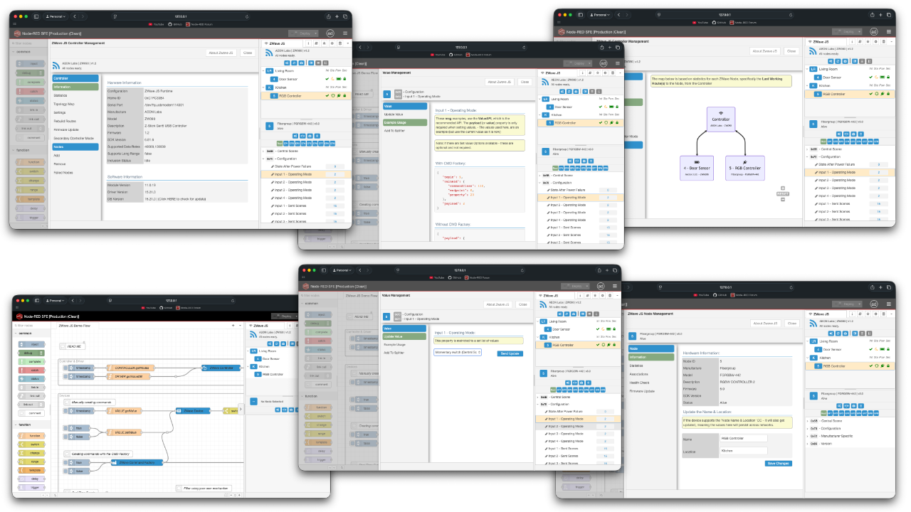
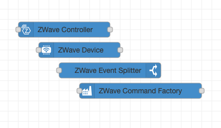

  

# node-red-contrib-zwave-js

The most powerful, high performing and highly polished Z-Wave node for Node-RED based on Z-Wave JS. If you want a fully featured Z-Wave framework in your Node-RED instance, you have found it.

> ### ...node-red-contrib-zwave-js is _hands down the best Z-Wave to Node-RED option on the planet._  
> [@CRXPorter](https://github.com/crxporter), July 2021.  

## What is it?

 - Part of the awesome [Z-Wave JS](https://github.com/zwave-js) org
 - 100% Javascript, so its blazing fast!
 - Does not require a build of any static library
 - Stable
 - A deep integrated UI within in node red
 - Full Z-Wave control inside Node-RED including:
   - Multi Stick/Network support
   - Device inclusion/exclusion wizard
   - Long Range Support
   - Secondry Controller Support
   - S0 and S2 security support
   - Supports Security S2 Smart Start
   - Network health checks  
   - Network mesh graph
   - Device (and controller) Firmware updates
   - Advanced RF configuration
   - NVM Backup/Restore
   - Associations management
   - Filter node for handling incoming messages from your devices
   - Factory node for simplifying the formatting of outgoing messages
   - Multicast command support
   - And much more..

Since `node-red-contrib-zwave-js` is based on [Z-Wave JS](https://zwave-js.github.io/node-zwave-js/#/), we have the support and active maintenance from the amazing group of developers who have built the libraries, APIs, and config files which run this module.

## The User Interface

Included with this module is a complete user inerface where Z-Wave network management is handled. Its deeply integrated into Node RED and fits right in.

 

## The Nodes

In addition to the **Configuration** node, which runs the Z-Wave stack, this module includes four additional node types:

| Node | Used For |
|------|----------|
| **Z-Wave Controller** | Provides access to all available commands and receives system-level events. |
| **Z-Wave Device** | Designed for controlling individual devices and listening for status changes from your devices. |
| **Z-Wave Event Splitter** | Filters network traffic so that only the events you care about are passed through. |
| **Z-Wave Command Factory** | Instead of writing commands manually, this node generates them automatically. |

To understand the commands available: click [here](./Command%20Manual.md)  
and of course the  [Change Log](./CHANGELOG.md)

## Awesome People - Thanks!

 - [marcus-j-davies](https://github.com/marcus-j-davies) our main developer who claims "*my software doesn't have bugs*"
 - [AlCalzone](https://github.com/AlCalzone) for creating [ZWave-JS](https://github.com/zwave-js/node-zwave-js) that makes this possible
 - [hufftheweevil](https://github.com/hufftheweevil) for creating the User Interface tab
 - [CRXPorter](https://github.com/crxporter) for creating all the help material/finding this project
 - [thk](https://github.com/thk-socal) for the relentless beta testing

 ## License
 MIT License

Copyright (c) 2019 Marcus Davies

Permission is hereby granted, free of charge, to any person obtaining a copy
of this software and associated documentation files (the "Software"), to deal
in the Software without restriction, including without limitation the rights
to use, copy, modify, merge, publish, distribute, sublicense, and/or sell
copies of the Software, and to permit persons to whom the Software is
furnished to do so, subject to the following conditions:

The above copyright notice and this permission notice shall be included in all
copies or substantial portions of the Software.

THE SOFTWARE IS PROVIDED "AS IS", WITHOUT WARRANTY OF ANY KIND, EXPRESS OR
IMPLIED, INCLUDING BUT NOT LIMITED TO THE WARRANTIES OF MERCHANTABILITY,
FITNESS FOR A PARTICULAR PURPOSE AND NONINFRINGEMENT. IN NO EVENT SHALL THE
AUTHORS OR COPYRIGHT HOLDERS BE LIABLE FOR ANY CLAIM, DAMAGES OR OTHER
LIABILITY, WHETHER IN AN ACTION OF CONTRACT, TORT OR OTHERWISE, ARISING FROM,
OUT OF OR IN CONNECTION WITH THE SOFTWARE OR THE USE OR OTHER DEALINGS IN THE
SOFTWARE.
